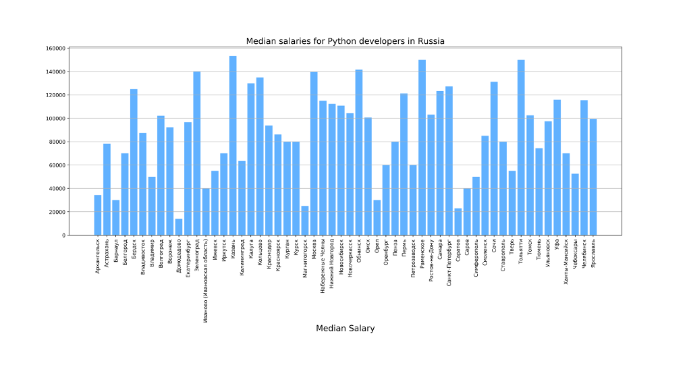

I did script which parsing data from hh.ru, analyze them and display chart with median salary of Python developers in Russia.

Python 3.6. 
You must install tkinter.

After running, parsed data saving in file csv and plot automatically saved in file png to your current directory.

